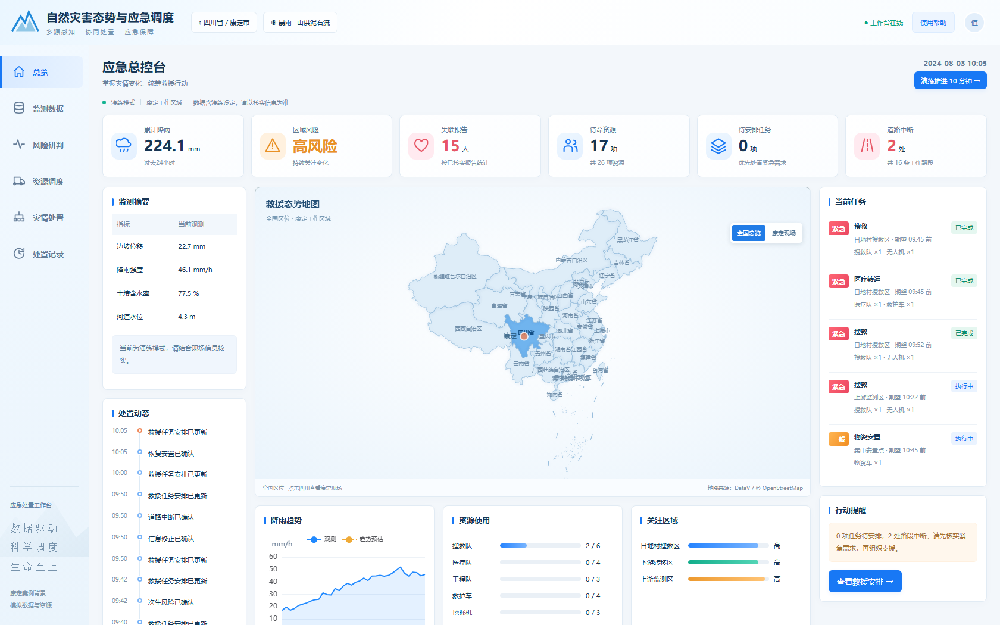

# 康定案例 · 动态灾害应急决策与资源调度

当前默认入口为面向值守与展示的业务工作台，支持完整全国地图与康定现场切换。技术配置、实验报告和原始诊断不进入日常页面。

V2.3 核心能力：多源环境观测、联合预测、九阶段事件、DeepSeek 辅助理解、人工确认与动态资源调度。本地单机运行，不需要公网部署。



## 启动

已有环境：运行 `./run-v2.ps1`，打开 **http://127.0.0.1:8800**。服务先预热模拟与历史预测模型，就绪后接受请求。

新环境使用 Python 3.11 和 Node.js/npm：

```powershell
python -m venv .venv
.\.venv\Scripts\python.exe -m pip install -r requirements-v2.lock.txt
npm --prefix frontend ci
.\.venv\Scripts\python.exe scripts/prepare_frontend.py
.\run-v2.ps1
```

依赖与数据已固定。首次安装需要联网；安装完成后默认本地 OSM 矢量底图、调度、预案检索和规则提取可离线运行。在线底图需手动切换，不是启动依赖。

## DeepSeek

在项目根目录 `.env` 中配置，格式见 [.env.example](.env.example)：

```dotenv
DISASTER_API_KEY=在本机填写
DISASTER_BASE_URL=https://api.deepseek.com
DISASTER_MODEL=deepseek-v4-flash
```

兼容原先仅一行密钥的文件。环境变量优先，修改后重启；`.env` 不入库。模型只生成候选，字段与证据校验后仍需人工确认。失败时明确回退规则，不自动派遣资源。

## 五分钟演示

1. **总览 / 监测数据**：从全国地图切换到康定现场，查看观测、任务、道路和资源。保留演练与历史资料标识。
2. **灾情处置**：点击“重新开始演练”，依次“准备下一阶段 → 核对表单 → 核实并确认报告”。九阶段包括封路、资源故障、增援、次生风险与人数修正，也可自行录入现场报告。
3. **资源调度**：查看路径、协同作业时间轴、资源缺口和预计到达变化；可选择兼顾整体响应或优先紧急需求。已执行动作保持锁定。
4. **风险研判 / 处置记录**：查看趋势与关注区域，读取历史态势和人员统计修正记录。研究实验与技术参数另见研究文档，不进入日常页面。

准备阶段会推进既有执行和模拟时钟；批准才提交候选。人数版本链为 **8 → 13 → 15**，不是重复累加。

## 结果与材料

- [最终研究报告](docs/final-report.md)：120条冻结挑战文本、三方法比较、预热与请求优化、前端验收及研究限制。
- [12页汇报 PPT](deliverables/v23/final_presentation.pptx) · [演示讲稿](deliverables/v23/final_speaker_notes.md)。
- [详细操作与模型说明](README-V23.md) · [旧版文档与基线归档](docs/archive.md)。
- [冻结评测集及标注来源](data/v23/final/ood_manifest.json) · [完整结果](results/v23/final/)。

保留此前300组调度、140组β敏感性与180组压力实验，约束违规为0。新增自然语言数据是开发过程辅助制作的留出挑战集，尚无第三方独立标注，不能称为真实场景泛化证明。模型没有全面优于规则；校验通过也不代表语义一定正确。

**边界**：康定案例背景与历史环境来源真实；九阶段时间、人数、任务、队伍、故障、增援、风险映射及调度行程为实验设定。地图背景来自2026年OSM快照，不是2024年灾时路网。系统不还原真实指挥记录，不证明现实救援效果。资源保留与地形易发性留作后续工作。

## 验证与复现

```powershell
$env:OMP_NUM_THREADS='1'
$env:OPENBLAS_NUM_THREADS='1'
$env:DISASTER_ENABLE_RESEARCH_API='1' # 仅为旧接口兼容测试开启
.\.venv\Scripts\python.exe -m pytest -q
Remove-Item Env:DISASTER_ENABLE_RESEARCH_API
.\.venv\Scripts\python.exe -m scripts.benchmark_warmup
# 120次真实模型请求，会产生API用量；文本和标签已冻结
.\.venv\Scripts\python.exe -m disaster.v2.ood_evaluation
# 本机服务运行后，系统Python需有Playwright和Chromium
python scripts/browser_workspace.py
.\.venv\Scripts\python.exe scripts/final_report.py
```

浏览器脚本会重置演示并完成九阶段；历史快照保留。性能测试应独立运行，避免与完整测试套件争用CPU；启动成本和事件处理耗时分别报告。

## 业务界面与维护边界

[本轮界面说明](docs/workspace.md)。默认只开放 `/api/workspace/` 的业务接口，旧研究接口与接口文档关闭；维护人员如需运行旧评测，可在本机进程设置 `DISASTER_ENABLE_RESEARCH_API=1`，完成后关闭并重启。该开关不是用户权限系统，不作为公网访问控制。旧研究页面源码归档于 `docs/archive/workbench-v23/`，不再由网页加载或通过静态资源入口提供。
