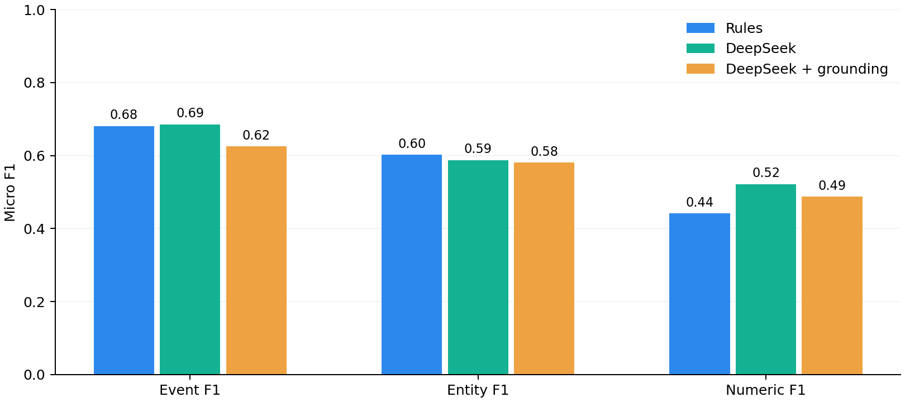
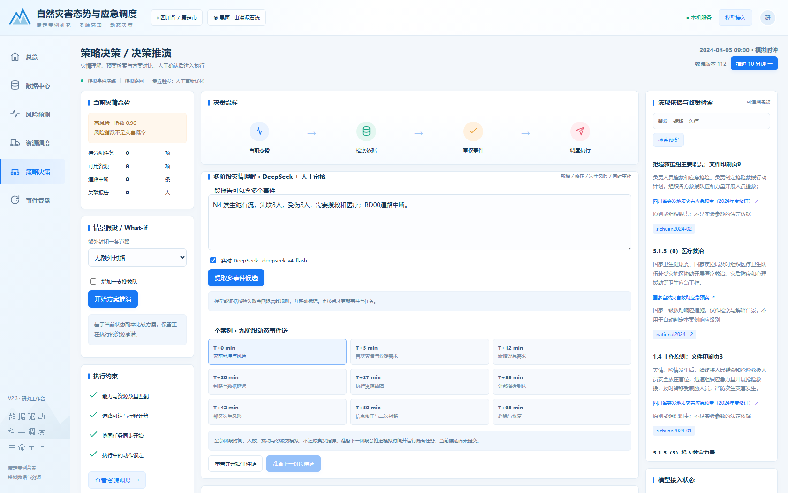

# V2.3 最终研究报告

本轮冻结已有功能边界，补充自然语言挑战评测、预测预热与请求优化，并统一六页工作台与最终汇报入口。保留康定一个真实案例背景，九阶段事件与资源参数仍为实验构造。

## 1. 自然语言理解：并未证实模型全面优于规则

120条文本分为简单、口语、长文本、多事件、修正、模糊地点、噪声、无关、同义、否定、不完整及指令干扰12类，每类10条。文本与显式标签在调用前冻结，未使用规则提取器生成标签，也未根据结果调整提取提示或校验规则。SHA-256见 [标注清单](../data/v23/final/ood_manifest.json)。

**独立性限制**：数据由同一开发过程辅助编写，尚未经过第三方人工独立标注。因此称为“冻结留出挑战集”，不能称为独立真实灾情OOD验证集；100–200条规模已达到，但第三方独立复核仍待完成。

每条只请求一次真实DeepSeek；原始输出与加grounding的方法共享该响应。校验拒绝按弃答计分；实际规则回退保存于原始记录，但不计作模型成功。Rules也单独计算证据校验通过率。

| 方法 | 事件F1 | 实体F1 | 数值F1 | 校验通过率 | 回退率 | P50/ms | P95/ms |
|---|---:|---:|---:|---:|---:|---:|---:|
| Rules | 68.09% | 60.17% | 44.12% | 99.17% | 0.00% | 0.2 | 0.5 |
| DeepSeek | 68.57% | 58.73% | 52.17% | 75.83% | 0.00% | 1349.3 | 2568.0 |
| DeepSeek + grounding | 62.50% | 58.04% | 48.72% | 75.83% | 24.17% | 1349.4 | 2568.1 |

计分使用逐文本多重集合的micro F1，重复输出计为额外预测。事件统计排除uncertain_report，把它作为弃答；实体元组绑定事件类型、字段和值（地点/道路/资源/站点/需求）；数值元组还绑定地点、失联或受伤字段及absolute/delta口径。因此这些分数不能直接等同于无事件关联的通用NER指标。空标签不产生真阳性。

27条没有明确可执行事实的文本中，规则、原始模型和校验后模型的候选误报率分别为 48.1% / 22.2% / 18.5%。这里衡量错误候选，不是已经执行的错误派遣。所有操作仍有人工确认。

**关键结果**：原始模型数值覆盖优于本规则，但实体F1较低、事件F1仅接近；严格校验降低了错误候选，也拒绝部分语义正确但不符合现有证据格式的表达。子串和数字邻近验证不是完整语义蕴含验证，尤其不能保证理解否定、指代及数量作用域。不能据此写“LLM显著提升理解准确率”或“grounding消除幻觉”。

API耗时包含现有提取包装器的校验和失败处理；grounded列另加一次复核耗时，不是独立的纯网络延迟。分组结果与所有原始输出见 [汇总](../results/v23/final/ood_summary.json) / [记录](../results/v23/final/ood_records.json)。

## 2. 冷启动与事件请求分开

FastAPI lifespan在接受请求前预热两种环境的三个模型与两种风险排序。训练仍只读取第0分钟前已接收的历史；预热不写事件、任务或状态。旧版预测器改为仅在归档评测访问时初始化，当前请求不再训练闲置的旧模型。预测结果缓存上限256项。

性能剖析发现延迟事件反复读取同一观测窗口，并创建数万个ORM对象。现使用SQLAlchemy字段映射直接读取普通字典，在刷新和页面返回内复用观测窗口；没有引入额外数据库、后台服务或持久缓存。自动化测试逐字段核对旧ORM结果与新路径一致。

| 预热后事件路径 | 次数 | P50/ms | P95/ms | P99/ms | 约束违规 |
|---|---:|---:|---:|---:|---:|
| synthetic | 30 | 719.07 | 849.07 | 879.07 | 0 |
| historical | 30 | 160.19 | 212.20 | 247.35 | 0 |

每种环境相同延迟事件重复30次，每次清空预测结果缓存、保留训练模型；包含批次校验、调度、SQLite保存与状态返回，排除HTTP/LLM网络。求解预算0.3秒。P99仅为30次小样本插值。**与旧内存压力测试口径不同，不直接用旧3.35秒除以新P95声称加速倍数。**

| 独立进程启动 | 服务初始化/ms | 额外预热/ms | 就绪总耗时/ms |
|---|---:|---:|---:|
| 1 | 12370 | 2604 | 14975 |
| 2 | 12574 | 2566 | 15140 |
| 3 | 12206 | 2657 | 14863 |

冷启动使用新建临时数据库，包含首次导入数据；现有本机库的启动成本可能不同。最终性能测试单独运行；此前同口径优化前记录以及与完整测试争用CPU的中间结果均保留，不能忽略负载差异做严格归因。见 [最终测量](../results/v23/final/warmup_benchmark.json)、[优化前](../results/v23/final/warmup_before_reads.json)、[并发验证期间](../results/v23/final/warmup_during_validation.json)。

## 3. 参考图对应的前端收敛

- 统一浅蓝导航、白色卡片、告警色、轻量SVG图标、表格及图表排版；总览首屏以态势地图和关键指标为主。
- 复用Leaflet和ECharts，没有新增框架、图标包或动画库；默认本地OSM矢量背景约59KB，Canvas绘制349条简化背景道路。地图只请求一次本地背景，切页复用；图表与地图在离开页面时释放。
- 本地路网/在线底图、风险/资源图层开关和全图定位均可操作；同位置资源按数量聚合，不人为偏移经纬度。风险圆是实验可视化范围，不是假造的地形灾害边界。
- 策略页删除重复的单事件入口，统一多事件候选卡片、证据与字段编辑；九阶段进度清晰显示。数据治理、参数与完整追踪后置，保留功能且避免诊断信息占满首屏。
- 六页验证1680、1280、390像素，无水平溢出；默认地图禁止外网仍可用。保留键盘焦点、图层按下状态、状态播报和减少动态效果设置。

背景道路来自仓库已有2026年OSM快照，不伪称2024年现场道路或卫星影像；其简化仅用于显示，求解器仍用选择的结构化路网。未复制参考图中没有数据支撑的人数、地质坡度、概率、物资总量或装饰性功能按钮。

## 4. 验收与冻结边界

原有73项完整测试通过，覆盖先前69项及本轮新增4项；惰性旧模型初始化另行运行兼容测试。九阶段浏览器回放覆盖实时模型提取、拒绝、人工批准、修正、词典序切换、地图控制和重复切页；最终失联15人、报告版本3。机器可读记录见 [浏览器验收](../results/v23/final/browser_validation.json)。

保留此前300组调度、140组β敏感性、180组压力实验的0约束违规结论，不把不同输入与计时口径混成同一实验。词典序在P1完成上略高但响应、缺口及撤回存在代价；预测前置仍只使用剩余容量。地形易发性、暴露度映射、当前任务与未来需求的资源保留继续列为后续工作。

本系统的贡献是一个可核验的连续决策研究链，而不是证明模型必胜或还原真实救援。所有模拟边界保留；第三方自然语言标注复核与真实应用效果验证没有完成。当前入口见 [README](../README.md)，历史版本见 [归档](archive.md)。
