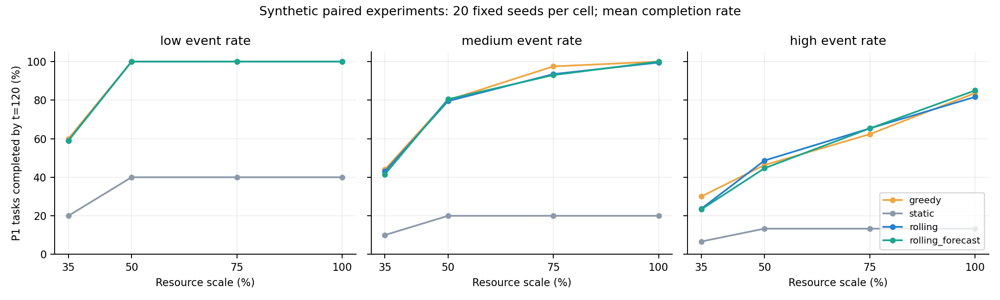

# V2.2 实验结果（由 CSV 自动生成）

本表来自全部960条配对记录，不筛选算法胜出的种子。4种资源比例 × 3种事件强度 × 20种子，每方法240条；统计至第120分钟。任务、资源、事件和通行时间为模拟设定。

| 方法 | P1完成率 | 已开始任务平均响应/分 | 未满足资源单位 | 实际行程/分 | 改派 | 撤回 |
|---|---:|---:|---:|---:|---:|---:|
| greedy | 75.32% | 25.76 | 22.08 | 264.44 | 8.48 | 5.92 |
| static | 21.39% | 15.14 | 49.75 | 109.86 | 0.00 | 0.00 |
| rolling | 74.49% | 23.87 | 19.98 | 268.65 | 6.72 | 11.33 |
| rolling_forecast | 74.36% | 23.75 | 20.47 | 274.03 | 6.65 | 12.45 |

总均值仅作概览；同一方法在不同资源/事件组合上的变化见下图与 [48个分组结果](../results/v22/scheduling_summary.csv)。响应只覆盖已经开始的任务，Static 的低响应值伴随大量未满足任务，不能当作更好的服务。

## 响应目标消融

同一批20种子，50%资源 / 高事件强度，只改变 β；禁用预测前置。

| 响应权重 | P1完成率 | 已开始任务平均响应/分 | 未满足资源单位 |
|---|---:|---:|---:|
| β=0 | 48.00% | 33.51 | 50.70 |
| β=10 | 48.67% | 34.38 | 50.80 |

加入响应项修正了“期限内早到没有代价差异”的建模问题，但本次消融不支持所有指标均改善的结论。优化的是每轮加权目标，评价的是完整执行过程；开始任务集合、任务优先级与超时解都可能不同。

## 压力与约束审计

| 第17分钟注入情景 | 事件处理与重规划/ms | 全程违规 | 最终预测可用于前置 |
|---|---:|---:|---|
| road_closure | 43.93 | 0 | True |
| new_p1 | 24.37 | 0 | True |
| resource_failure | 42.38 | 0 | True |
| delayed_sensor | 32.40 | 0 | False |
| reinforcement | 21.72 | 0 | True |
| simultaneous | 82.86 | 0 | True |

960组调度、20组消融、6组压力测试的逐分钟执行审计均为0违规。延迟数据情景最终禁用预测前置。压力测试仅各运行一次，耗时不是可靠的分位数或服务等级保证。

## 预测误差

以下仅汇总三个点降雨的MAE，单位 mm/h；全部变量、点位、RMSE与样本数保留在原CSV。真实小时与模拟五分钟表分开，不跨频率比较优劣。

### 模拟降雨

| 模型 | MAE@5分 | MAE@15分 | MAE@30分 | MAE@60分 |
|---|---:|---:|---:|---:|
| Persistence | 1.711 | 2.376 | 3.924 | 7.630 |
| AR | 5.900 | 3.482 | 4.376 | 8.706 |
| Gradient Boosting | 5.571 | 6.597 | 8.526 | 13.083 |

### 真实历史产品降雨

| 模型 | MAE@60分 | MAE@180分 | MAE@360分 | MAE@720分 |
|---|---:|---:|---:|---:|
| Persistence | 0.029 | 0.055 | 0.077 | 0.319 |
| AR | 0.030 | 0.050 | 0.164 | 0.407 |
| Gradient Boosting | 0.092 | 0.223 | 0.494 | 0.506 |

IMERG Final和ERA5-Land包含事后处理信息，此表是最终历史产品上的留出序列预测误差，不能证明2024年当时可在线获取的灾害预警能力。

## 结论范围

完整保留滚动调度、预测前置或响应目标未胜出的结果。总表中滚动方法的平均条件响应与缺口较贪心有所下降，但P1完成率未全面领先；前置也未在各指标上持续改善。应按资源比例和事件强度逐组分析，而不是把系统复杂度解释成算法优势。

未满足量与区域未服务数必须和条件响应、区域Gini一起解读。前置目前是剩余资源下的情景覆盖代理，没有同时多区域需求的容量补救优化。所有实验均不能推出真实康定救援效果。

原始文件：[调度](../results/v22/scheduling.csv)、[消融](../results/v22/ablation.csv)、[压力](../results/v22/stress.csv)、[模拟预测](../results/v22/forecast_synthetic.csv)、[历史预测](../results/v22/forecast_historical.csv)。复现参数与方法限制见 [V2.2说明](../README-V22.md)。

重新生成本文与图片：`python scripts/summarize_v22.py`。
