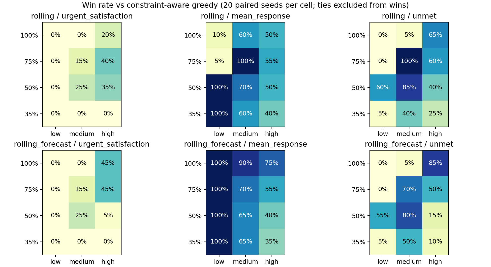
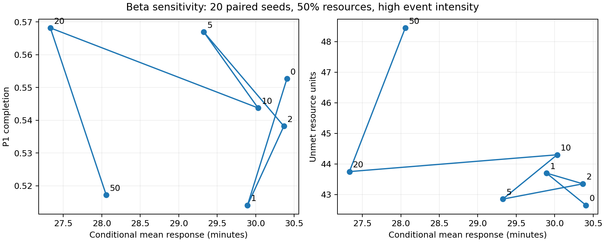
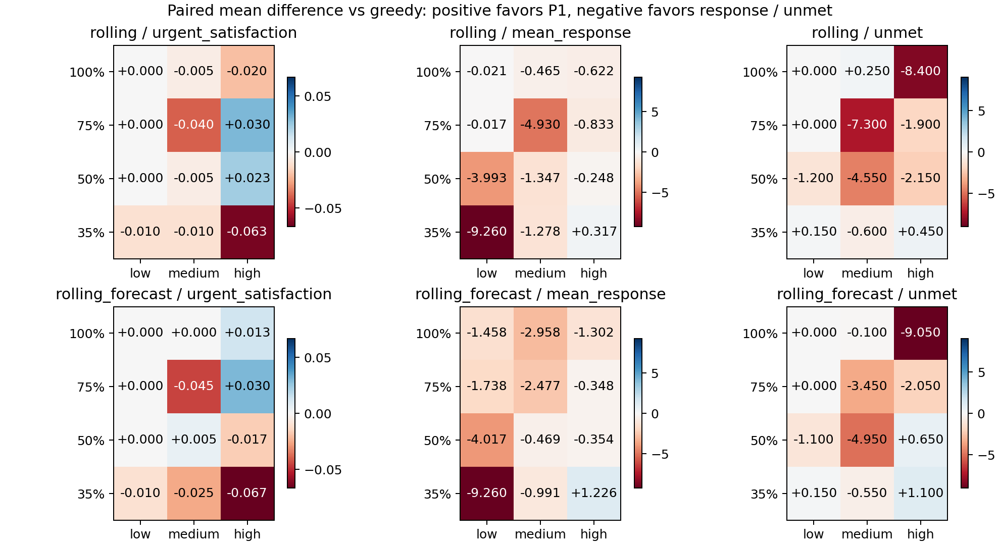

# 事件链与模型接入：实际实验结果

本次沿用康定案例背景，不添加其他灾种。调度新实验与V2.2旧960组分开；旧结果用于配对bootstrap，新异构事件用于词典序和权重对照。

## 真实 DeepSeek 抽取

模型：`deepseek-v4-flash`。50条人工编写、人工标注的模拟文本，使用同一输入比较规则与实时API；这是工程诊断集，不是独立真实灾情测试集。规则与数据生成由同一开发过程编写，其高分存在模板贴合优势。

| 方法 | 事件类型准确率 | 地点准确率 | 伤亡F1 | 道路F1 | JSON有效率 | 平均延迟/ms |
|---|---:|---:|---:|---:|---:|---:|
| rules | 100.0% | 100.0% | 100.0% | 100.0% | 100.0% | 0.3 |
| deepseek | 74.0% | 74.0% | 100.0% | 100.0% | 100.0% | 1188.7 |

实时结构与依据校验通过率为 82.0%。失败调用在DeepSeek指标中按空预测处理，离线回退不会冒充模型成功。部分失败来自模型推测未给出的节点或把站点ID放进node；原始输出完整保留。事件类型与地点是整条报告的集合精确匹配；伤亡F1按地点/字段/计数模式/数值的微平均集合计算，道路按事件类型/道路ID计算。

初轮 `intake_*_initial.json` 保留；随后修复中文字符紧邻编号时的词边界校验，再运行50条。未修改提示词和标签来追求分数。两轮都属于开发过程诊断，不能称为未知数据泛化评估。

## 词典序与异构事件对照

20种子 × 3事件强度 × 5方法 = 300组；固定每类资源50%，同类型最少保留1项。新增任务随机改变地点、资源组合、P1比例、发布时间与时长；中/高强度在32分钟加入资源故障，高强度在55分钟加入第二条封路。各方法使用相同的已生成输入及执行器。

| 方法 | P1完成率 | 已开始任务平均响应/分 | 未满足资源单位 | 改派 | 撤回 |
|---|---:|---:|---:|---:|---:|
| greedy | 77.73% | 31.12 | 26.53 | 8.03 | 8.77 |
| static | 22.21% | 16.23 | 45.17 | 0.00 | 0.00 |
| rolling | 78.33% | 26.10 | 23.83 | 9.13 | 13.23 |
| lexicographic | 78.77% | 29.91 | 25.85 | 8.87 | 19.00 |
| rolling_forecast | 77.85% | 26.35 | 24.10 | 9.00 | 14.42 |

词典序共1275轮调用，983轮证明首层P1缺口最优，961轮完成全部四层证明。每轮总求解预算0.3秒，各层均分剩余预算；首个未证明最优的层级即停止，保留可行解。

贪心是约束感知、优先级驱动的贪心；Static仅初始规划，其低条件响应与大量未满足并存。不要将上述均值解释为所有资源/任务条件下的优势。

## 配对统计

V2.2原960组数据按资源比例/事件强度分格，同种子取滚动减约束感知贪心。每格20对，10,000次固定种子bootstrap，报告平均差、中位差、点态95%百分位区间、配对标准化效应、胜率和平局率。胜率分母包括平局；并非只在非平局中计算。未做多重比较校正，按探索性结果解读，不用是否跨0筛选展示。

完整72项分格统计见 [paired_statistics.csv](../results/v23/paired_statistics.csv)。响应降低为负差、P1提高为正差；条件响应不能单独替代完成率和未满足量。

## 响应权重敏感性

| β | P1完成率 | 条件响应/分 | 未满足单位 |
|---|---:|---:|---:|
| 0 | 55.27% | 30.41 | 42.65 |
| 1 | 51.40% | 29.89 | 43.70 |
| 2 | 53.82% | 30.37 | 43.35 |
| 5 | 56.69% | 29.33 | 42.85 |
| 10 | 54.37% | 30.03 | 44.30 |
| 20 | 56.82% | 27.33 | 43.75 |
| 50 | 51.71% | 28.06 | 48.45 |

每个β均用20个相同种子，不按本表自动选择“最优β”。先报告多指标折中；默认β=10仅保留兼容操作点，不声称经独立测试选优。

## 重复压力测试

| 情景 | 次数 | P50/ms | P95/ms | P99/ms | 违规 |
|---|---:|---:|---:|---:|---:|
| delayed_sensor | 30 | 37.81 | 3349.45 | 3439.57 | 0 |
| new_p1 | 30 | 36.65 | 48.74 | 56.85 | 0 |
| reinforcement | 30 | 25.85 | 33.99 | 37.46 | 0 |
| resource_failure | 30 | 60.08 | 80.82 | 84.45 | 0 |
| road_closure | 30 | 58.11 | 72.67 | 77.82 | 0 |
| simultaneous | 30 | 86.72 | 124.17 | 140.95 | 0 |

每情景重复30次，同场景输入、完整执行，每分钟约束审计。该延迟覆盖内存服务的事件处理和重规划，不含HTTP、SQLite与模型网络调用；并发运行与机器负载会影响数值，P99是小样本插值估计。压力实验沿用V2.2连续处理多事件口径；页面新批次接口另有单次重规划的原子确认测试。

300组调度、140组β实验及180组压力测试均0约束违规。九阶段页面另外验证了修正历史、次生风险、数据延迟、增援、拒绝候选、真实模型调用以及词典序切换。

## 能与不能得出的结论

本轮证明了事件和模型输入能进入经过校验、人工确认、统一重规划的执行链；统计分析更清楚地暴露不同调度方法的折中。它不证明大模型必然优于规则、词典序必然优于加权优化或真实救援有效。

地形易发性、资源保留/完整两阶段随机优化仍未实现。本轮没有扩大灾种，也没有把模拟阶段写成历史事实。重现说明见 [README-V23.md](../README-V23.md)。

差值热力图采用各指标统一的对称色标：

压力实验混合了各工作进程首次初始化预测器与后续缓存命中；delayed_sensor 的尾部耗时包含这种冷启动成本，不能解释为稳定热启动延迟。
